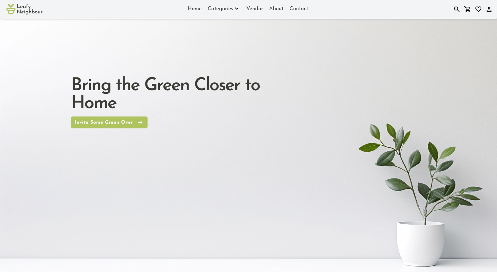
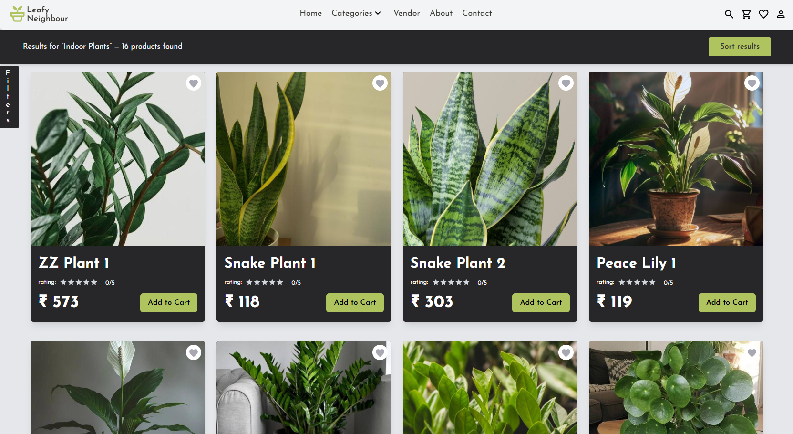
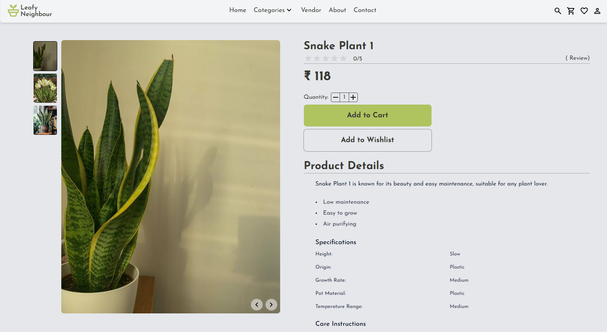
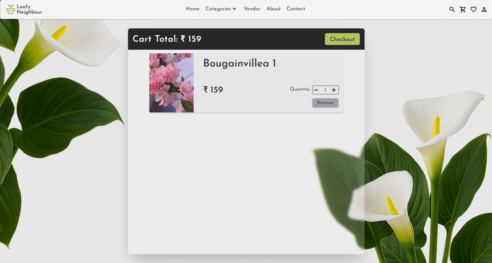
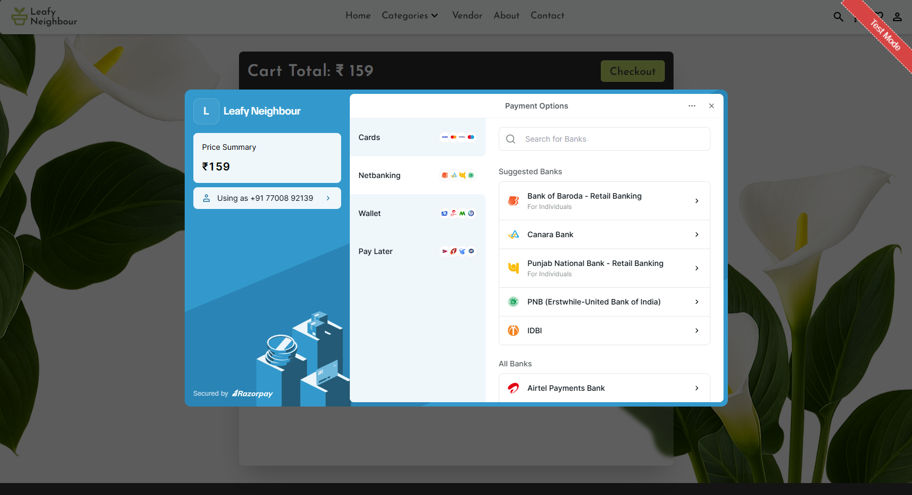
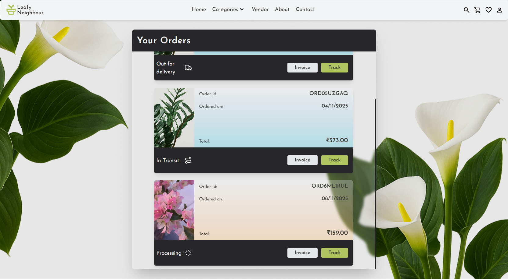
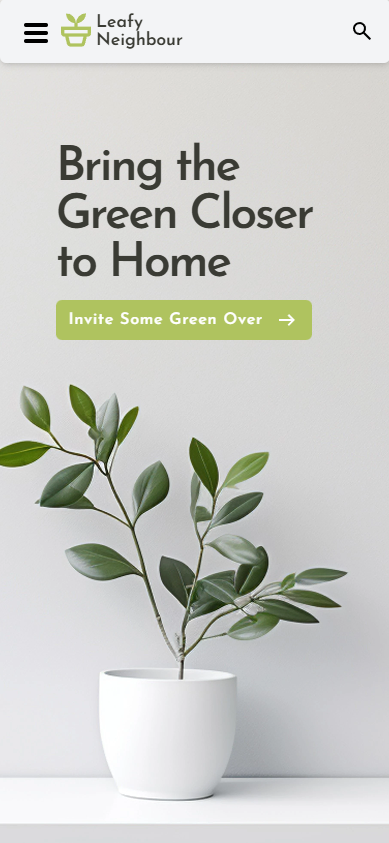
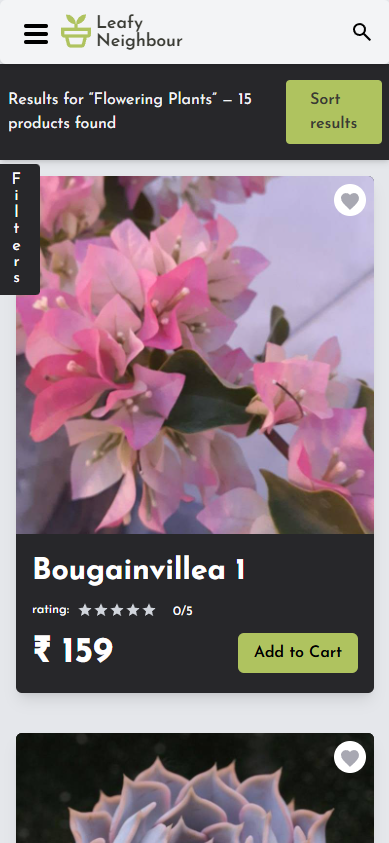
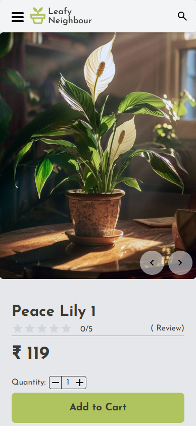

<p align="center">
  
</p>

<h2 align="center">Leafy Neighbor</h2>
<p align="center"><em>A Simple, Clean, Plant-Focused Marketplace</em></p>

<p align="center">

  
  
  
  
  
  
  
  <br>
  <a href="https://leafy-neighbor.vercel.app/">
    
  </a>

</p>


---

## 🌿 Overview

Leafy Neighbor is a full-stack e-commerce application for discovering and purchasing indoor and outdoor plants.  
It supports vendor-based listing, user authentication, cart + order management, and a clean React UI for a smooth shopping experience.

This project focuses on:
- Efficient API development with **Django REST Framework**
- Modern UI implementation with **React + Context**
- Role-based access for **buyers and vendors**
- Real-world e-commerce flows (Listings → Cart → Order)

---

## ✨ Features

- 🛍️ **Product Browsing** with categories & search
- 🧺 **Cart & Checkout** system with order summaries
- 🔐 **JWT Authentication** (Register / Login / Persistent Sessions)
- 🛒 **Vendor Dashboard** to list & manage products
- ❤️ **Wishlist support**
- ⭐ Product rating UI (ready for rating backend integration)
- 🗄️ PostgreSQL database integration
- 🏞️ Cloud-ready media/image handling (Cloudinary)

---

## 🛠️ Tech Stack

| Layer | Technology |
|------|------------|
| Frontend | React, React Router, Context API, Tailwind / CSS |
| Backend | Django, Django REST Framework |
| Authentication | JWT (SimpleJWT) |
| Database | PostgreSQL |
| Deployment | Vercel / Render / Docker Compose Ready |

---

## 🚀 Live Demo

**Frontend:** https://leafy-neighbor.vercel.app/  
**Backend API:** *(optional – add if public)*

---

## 🖼️ Screenshots

### Landing Page
<p align="center"></p>

---

### Browse / Category Results
<p align="center"></p>

---

### Product Detail Page
<p align="center"></p>

> _Showcases product image, price, wishlist toggle, description, and Add to Cart._

---

### Cart Page
<p align="center"></p>

> _Update quantities, remove items, proceed to checkout._

---

### Checkout & Orders Page
<p align="center"></p>
<p align="center"></p>

---

## 📱 Mobile Responsive Views

<p align="center">
  
  
  
</p>

> Fully responsive layout with optimized spacing and navigation for smaller screens.

---

## 🛠️ Installation & Setup

Follow these steps to run the project locally.

### 1. Clone the Repository
```bash
git clone https://github.com/AVi-PaTeTo/Leafy-Neighbor.git
cd leafy-neighbor
```

---

### 2. Create the `.env` File (Backend)

Inside the `backend/` directory:

```bash
cd backend/
touch .env
```

Add the following values:

```env
# Django Settings
SECRET_KEY=your_secret_key_here
DEBUG=True
ALLOWED_HOSTS=localhost,127.0.0.1,0.0.0.0

# PostgreSQL (Used by Docker)
POSTGRES_DB=leafydb
POSTGRES_USER=leafyuser
POSTGRES_PASSWORD=leafypass
POSTGRES_HOST=db
POSTGRES_PORT=5432

# Cloudinary (Recommended Media Storage)
CLOUDINARY_CLOUD_NAME=your_cloudinary_cloud_name
CLOUDINARY_API_KEY=your_cloudinary_api_key
CLOUDINARY_API_SECRET=your_cloudinary_api_secret
```

> Cloudinary is recommended.  
> Local media storage requires modifying `settings.py` and serving static files manually.

---

### 3. Start Backend & Database (Docker)

```bash
docker compose up --build
```

This will automatically:
- Run database migrations
- Collect static files
- Create a default admin user *(via `create_superuser.py`)*
- Start the backend with Gunicorn

> No manual migration or superuser setup required.

---

### 4. Start the Frontend
```bash
cd frontend/leafy
npm install
npm run dev
```

---

### ✅ Default Access

| Service | URL |
|--------|------|
| Web App | http://localhost:5173 |
| Django Admin | http://localhost:8000/admin |

> To change admin credentials, edit `backend/create_superuser.py`.

---

## 🌱 You're all set!
Enjoy exploring **Leafy Neighbor** 🌿

---

## 🔧 Known Issues / Future Improvements

- Global search does not trigger on some filtered/browse views (needs query refactor)
- Product image cannot currently be changed when editing an existing listing  
  *(UI and serializer update pending)*
- Improve vendor dashboard UI for product and inventory management
- Enhance accessibility and ARIA support across UI components
